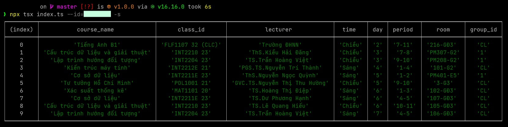

# uet-schedule-finder

A simple tool to get class schedule from UET's congdaotao

-   [uet-schedule-finder](#uet-schedule-finder)
    -   [Prerequisites](#prerequisites)
    -   [Installation](#installation)
    -   [Usage](#usage)
    -   [Example](#example)
    -   [License](#license)
    -   [Side note](#side-note)

## Prerequisites

-   NodeJS [v16.16.0](https://nodejs.org/en/blog/release/v16.16.0)

## Installation

```bash
npm install
```

## Usage

```bash
npx tsx index.ts --id=<student_id> [--simple|-s]
```

## Example



## License

[GNU GPLv3](./LICENSE)

## Side note

This project is just for fun and educational purpose. Please do not use it for any malicious purpose. Please do not use it to spam UET's server. I am not responsible for any damage caused by this project. Thank you.
